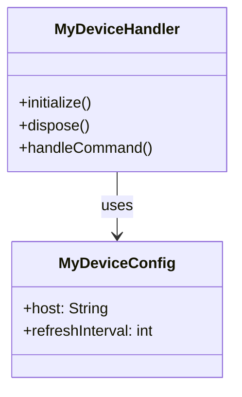
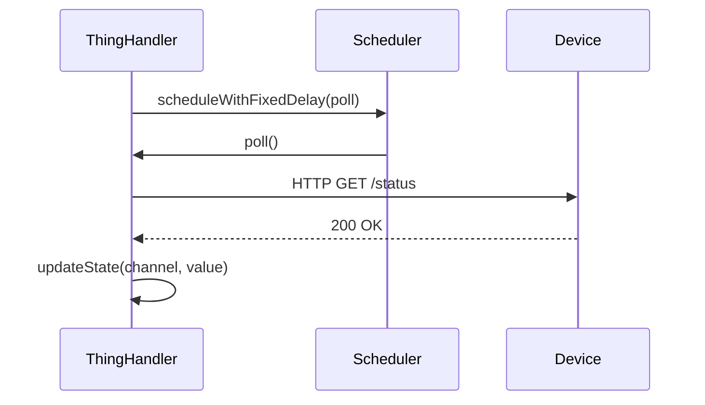
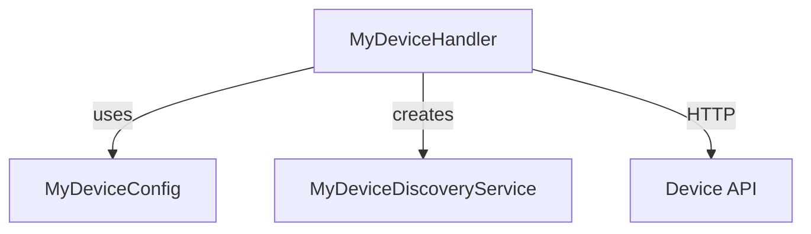

# ADR-000: [Short Title of the Decision]

## Status

> `Proposed` | `Accepted` | `Deprecated` | `Superseded by ADR-XXX`

## Context

What is the problem, requirement, or situation that makes this decision necessary?
Describe the forces at play — technical constraints, openHAB API limitations, device behavior, etc.

## Decision

What was decided?
State it clearly and directly: "We will use X because Y."

## Consequences

### Positive
- What becomes easier or better as a result?

### Negative
- What becomes harder, more complex, or is accepted as a trade-off?

## Diagram (optional)

Use a Mermaid diagram if it helps visualize the decision — e.g. class relationships, sequence flows, or component boundaries.

**Class diagram example:**

**Sequence diagram example:**

**Component diagram example:**

---

*Replace this template content. Remove unused sections and diagrams.*
